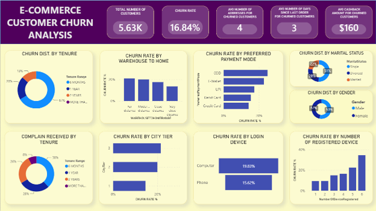

# E-Commerce Customer Churn Analysis & Retention Strategy

> **Portfolio Project by:** Hemant Sharma | Data Analyst


## 📌 Project Overview
Customer churn is a critical metric for any e-commerce platform, directly impacting revenue and long-term growth. This project analyzes the behavioral and demographic data of **5.63K** customers to identify the key drivers behind a **16.84%** platform churn rate. 

Through robust data cleaning in Power Query and advanced DAX modeling in Power BI, this analysis provides an interactive dashboard, saved as `ECOMMERCE CHURN ANALYSIS FINAL.pbix`[cite: 1], that uncovers actionable insights regarding customer tenure, logistics operations, and digital friction, enabling targeted retention strategies.

## 📊 The Dashboard


## 🛠️ Tech Stack & Tools
* **Data Visualization & Modeling:** Microsoft Power BI
* **Data Transformation:** Power Query (ETL)
* **Calculations:** DAX (Data Analysis Expressions)
* **Source Data:** Microsoft Excel (`ECOMMERCE_CHURN EXCEL.xlsx`)

## 📁 Dataset Description
The dataset encompasses customer demographics, transaction history, app engagement, and satisfaction metrics. 

| Feature | Description |
| :--- | :--- |
| `CustomerID` | Unique identifier for each customer |
| `Churn` | Target variable (1 = Churned, 0 = Retained) |
| `Tenure Range` | Categorized length of time the customer has been active |
| `CityTier` | Tier classification of the customer's home city (1, 2, or 3) |
| `WarehouseToHomeRange` | Categorized distance between the warehouse and customer location |
| `PreferredPaymentMode` | Standardized payment method (Credit Card, Cash on Delivery, UPI, etc.) |
| `NumberOfDeviceRegistered` | Total unique devices linked to the user's account |
| `Complain` | Binary indicator of whether a customer filed a complaint |
| `CashbackAmount` | Total cashback accumulated by the customer |

## ⚙️ Data Preparation & Cleaning (Power Query)
To ensure analytical accuracy and precise visualization, the following transformations were performed before building the data model:
* **Standardized Categorical Data:** Consolidated duplicated and messy text values in the `PreferredPaymentMode` column (e.g., merging "COD" and "Cash on..." into "Cash on Delivery", and "CC" into "Credit Card").
* **Visual Axis Sorting:** Configured categorical sorting for variables like `NumberOfDeviceRegistered` to ensure chronological rendering (1 through 6) rather than arbitrary size-based sorting.
* **Naming Conventions:** Renamed visualization titles to accurately reflect analytical definitions, strictly distinguishing between "Churn Rate" (the percentage of a cohort that left) and "Churn Distribution" (the makeup of the departed cohort).

## 🧮 Core DAX Measures
Custom DAX measures were engineered to track dynamic KPIs that respond accurately to cross-filtering on the dashboard.

```dax
// 1. Total Number of Customers
Total Customers = DISTINCTCOUNT(ECOMMERCE_CHURN1[CustomerID])

// 2. Churn Rate %
CHURN RATE % = 
DIVIDE(
    CALCULATE([Total Customers], ECOMMERCE_CHURN1[Churn] = 1),
    [Total Customers], 
    0
)

// 3. Average Addresses for Churned Customers
AVG ADDRESS (CHURNED) = 
CALCULATE(
    AVERAGE(ECOMMERCE_CHURN1[NumberOfAddress]),
    ECOMMERCE_CHURN1[Churn] = 1
)

// 4. Average Cashback Amount for Churned Customers
AVG CASHBACK AMOUNT FOR CHURNED CUSTOMERS = 
CALCULATE(
    AVERAGE(ECOMMERCE_CHURN1[CashbackAmount]),
    ECOMMERCE_CHURN1[Churn] = 1
)

// 5. Average Days Since Last Order for Churned Customers
AVG DAYS SINCE LAST ORDERS FOR CHURNED = 
CALCULATE(
    AVERAGE(ECOMMERCE_CHURN1[DaySinceLastOrder]),
    ECOMMERCE_CHURN1[Churn] = 1
)
